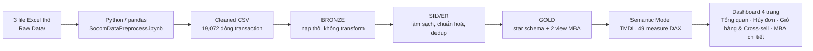

<div align="center">

# SOCOM Market Basket Analysis

### Bịt rò rỉ ₫878 triệu doanh thu do huỷ đơn, và tìm đúng cặp sản phẩm đáng gợi ý mua kèm

<p>
  
  
  
  
</p>

</div>

---

## Project Overview

Xuất phát điểm của project chỉ có 3 file Excel thô trong `Raw Data/`: dữ liệu bán hàng synthetic năm 2021 của **SOCOM**, nhà phân phối mỹ phẩm tại Việt Nam (L'Oréal Paris, Maybelline New York, Garnier). Toàn bộ phần còn lại (pipeline ETL Python, data warehouse kiến trúc Medallion 3 tầng trên SQL Server, semantic model 49 measure DAX, và dashboard Power BI 4 trang này) đều được xây từ đó.

Bài toán: SOCOM muốn **tăng doanh thu mà không tăng chi phí marketing**. Hai đòn bẩy được xác định: (1) bịt rò rỉ doanh thu do huỷ đơn, (2) tăng giá trị giỏ hàng qua cross-sell dựa trên Market Basket Analysis (MBA). Dashboard trả lời trực tiếp bài toán đó qua 4 trang, mỗi trang gắn với 1 nhóm câu hỏi và 1 nhóm stakeholder cụ thể, không chỉ báo cáo số liệu tổng quan.

Các câu hỏi project trả lời:
- Business đang khoẻ không? Doanh thu đến từ đâu? *(Chủ DN / quản lý chung)*
- Mất bao nhiêu doanh thu vì huỷ đơn? Rò rỉ dồn ở đâu? *(Vận hành / CSKH)*
- Vì sao giỏ hàng nhỏ? Điều gì kéo giỏ hàng to hơn? *(Marketing / merchandising)*
- Nên gợi ý mua kèm sản phẩm hoặc nhóm nào? *(Merchandising / CRM)*

> ⚠️ **Dữ liệu là synthetic (giả lập cho năm 2021).** Mọi số liệu trong README này minh hoạ phương pháp phân tích, không phải phát hiện kinh doanh thật. Chi tiết ở mục [Raw Data & Data Cleaning](#raw-data--data-cleaning).

## Table of Contents

- [Project Overview](#project-overview)
- [Project Highlights](#project-highlights)
- [Repository Structure](#repository-structure)
- [Raw Data & Data Cleaning](#raw-data--data-cleaning)
- [Data Pipeline](#data-pipeline)
- [Semantic Model](#semantic-model)
- [Dashboard](#dashboard)
- [Key Findings](#key-findings)
- [Tech Stack](#tech-stack)

## Project Highlights

| Area | What this project does |
| --- | --- |
| Data pipeline | Python/pandas làm sạch 3 file Excel thô → CSV; SQL Server Medallion Bronze → Silver → Gold, dedup theo `(order_id, product_name, version)`, stored procedure DROP & CREATE chạy lại an toàn. |
| Semantic model | Star schema Gold (10 bảng Dim/Fact) + 49 measure DAX chia 7 display folder (Revenue, Orders, Basket & AOV, Customer, Time Intelligence, Gift, MBA). |
| Market Basket Analysis | 2 tầng phân tích: cặp phân nhóm sản phẩm (`vw_MBA_SubCategory_Pairs`) và cặp sản phẩm cụ thể (`vw_MBA_Product_Pairs`), xếp hạng bằng measure tự thiết kế `Pair Priority Score = lift × ln(pair_order_count)`. |
| Cross-sell diagnostics | `Cross-sell Attach Rate` theo từng phân nhóm sản phẩm + so sánh Có quà/Không quà trên AOV, Basket Size, Net Revenue, Single-item Order %. |
| Dashboard | 4 trang Power BI (PBIR/PBIP), theme màu BIBB, thanh điều hướng dạng pill tự thiết kế, slicer đồng bộ liên trang. |

## Repository Structure

```text
Market basket Association/
|-- Raw Data/                                        # có sẵn từ đầu (gitignored, PII/synthetic, 3 file Excel)
|-- Cleaned_Data/                                     # xây trong quá trình làm (gitignored trừ product_category_map.xlsx)
|-- SocomDataPreprocess.ipynb                         # xây trong quá trình làm (Python ETL: Raw XLSX -> Cleaned CSV)
|-- SQL/                                              # xây trong quá trình làm
|   |-- init_database.sql, jobs_schedule.sql
|   |-- Bronze/   ddl_bronze_tables.sql, sp_load_bronze.sql, check_bronze_quality.sql
|   |-- Silver/   ddl_silver_tables.sql, sp_load_silver.sql, check_silver_quality.sql
|   `-- Gold/     ddl_gold_tables.sql, sp_load_gold.sql  (+ 2 view MBA)
|-- Power BI Project/                                 # xây trong quá trình làm (PBIP: TMDL model + PBIR report)
|   |-- SocomDataAnalysis.SemanticModel/
|   |-- SocomDataAnalysis.Report/
|   `-- SocomDataAnalysis.pbip
|-- Power BI Theme by BIBB.json                       # theme màu dùng cho dashboard
|-- Docs/                                             # data catalog, kế hoạch thiết kế dashboard
`-- Imgs/                                             # screenshot dashboard + model diagram (dùng trong README)
```

## Raw Data & Data Cleaning

Nguồn duy nhất của project là **3 file Excel thô trong `Raw Data/`** (gitignored), dữ liệu bán hàng **synthetic năm 2021** của SOCOM. Python (`SocomDataPreprocess.ipynb`) làm sạch 3 file này thành CSV trước khi nạp vào Medallion; bảng dưới là các file CSV sau bước làm sạch:

| File (`Cleaned_Data/`) | Số dòng | Ghi chú |
| --- | --- | --- |
| `Transaction_Data.csv` | 19,072 | Grain = dòng đơn hàng (order_id × product_id); nguồn cho `Fact_OrderLine` |
| `Gift_Data.csv` | 1,646 | Chỉ có `order_id` + `gift_name`, **không có `product_id`**; quà tặng ghi nhận ở cấp đơn hàng, không gắn với sản phẩm cụ thể |
| `Shipping_Data.csv` | 2,120 | Thông tin vận chuyển theo đơn |
| `Product_Taxonomy.csv` / `product_category_map.xlsx` | 146 | Bảng ánh xạ product → category/sub_category, review tay (nguồn chân lý, giữ lại dù `Cleaned_Data/` bị gitignore) |

**Vấn đề phát hiện trong dữ liệu nguồn và cách xử lý:**

| Vấn đề | Cách xử lý |
| --- | --- |
| Trùng dòng cho cùng 1 SKU trong 1 đơn hàng (`order_id, product_name, version`) | Dedup bằng `ROW_NUMBER()` ở tầng Silver, giữ dòng có `revenue` cao nhất mỗi nhóm |
| `discount_amount` trong raw có giá trị âm | Chuẩn hoá về giá trị tuyệt đối (`ABS()`) khi build Silver |
| Raw chỉ có `product_category` cấp 1, không có danh mục con | Xây bảng mapping product → category/sub_category bằng LLM (Ollama, `mapping_ollama.py`), review tay 146 tên, dùng làm nguồn chân lý cho `Dim_Category` |
| Giá trị rác ở field text (`manufacturer = "--"`, `customer_email` rỗng) | Lọc bỏ trước khi build Dim ở tầng Gold |
| Đơn huỷ vẫn giữ nguyên `revenue` gốc dù không thu được tiền | Tính riêng `amount_received = 0` cho mọi đơn `order_status = "Hủy"` ở tầng Silver, tách bạch doanh thu ghi trên chứng từ (gross) khỏi tiền thực nhận (net) |
| 75/1,614 đơn huỷ có `product_id` bị sinh với đơn giá đúng bằng ₫1 (artefact của bộ sinh dữ liệu) | Giữ nguyên số liệu gốc vì đây là dữ liệu synthetic, không tự ý sửa số; loại các dòng này khỏi mọi phân tích giá trị đơn hàng đơn lẻ, chỉ dùng ở cấp tổng hợp theo tháng nơi artefact không đáng kể |
| Quà tặng không có `product_id`, gán gần như ngẫu nhiên theo đơn (không theo rule nào phát hiện được) | Tách `Dim_Gift`/`Fact_Gift` độc lập khỏi `Dim_Product`; trên dashboard chỉ trình bày AOV có quà/không quà ở dạng mô tả, không dùng làm căn cứ đề xuất cross-sell |
| Không có cột COGS/OPEX | Giới hạn phạm vi phân tích vào doanh thu, đơn, giỏ hàng, khách hàng, MBA ngay từ đầu, không cố dựng P&L từ dữ liệu thiếu |
| `branch` chỉ là 2 kho/gian hàng, không phải vùng địa lý thật | Không tạo `Dim_Region` giả; bản đồ dùng ranh giới hành chính tỉnh/thành (geojson) ở cấp `Dim_Province`/`Dim_District` thay vì suy diễn vị trí kho |
| Doanh thu tháng 7 gần như bằng 0, tháng 8 bị cụt giữa tháng | Giữ nguyên trong `Dim_Date` dạng lịch liên tục, không cắt bỏ ngày thiếu dữ liệu; biểu đồ xu hướng và caveat đầu README ghi rõ đây là đặc điểm bộ dữ liệu synthetic, không phải xu hướng kinh doanh |

## Data Pipeline



## Semantic Model


Star schema Gold xoay quanh 2 fact table: `Fact_OrderLine` (grain = dòng đơn) và `Fact_Gift` (order × gift), nối tới `Dim_Order` (→ `Dim_Customer`, `Dim_Date`, `Dim_District` → `Dim_Province`) và `Dim_Product` (→ `Dim_Category` gộp category + sub_category, `Dim_Manufacturer`), `Dim_Gift`. Không có `Dim_Region` vì branch = kho/gian hàng, không đủ dữ liệu địa lý.

Điểm thiết kế đáng chú ý: quan hệ `Fact_OrderLine ↔ Dim_Order` là **2 chiều (bidirectional)**, để thuộc tính product/category lọc được các measure order-grain (`Orders`, `Cancel Rate`, `AOV`...). Hệ quả: khi cắt theo sản phẩm/category, số đơn đọc là "đơn **có chứa** nhóm X", không cộng dồn qua chiều sản phẩm; doanh thu vẫn cộng dồn đúng.

49 measure DAX chia 7 display folder (Revenue, Orders, Basket & AOV, Customer, Time Intelligence, Gift, MBA). Điểm nhấn là measure tự thiết kế `Pair Priority Score = MAX(lift) × LN(MAX(pair_order_count))`, dựng riêng cho cả cặp phân nhóm và cặp sản phẩm cụ thể: kết hợp độ mạnh liên kết (lift) với độ tin cậy về khối lượng mẫu (pair_order_count), để tránh xếp hạng cao nhầm những cặp lift cao nhưng chỉ xảy ra ở vài đơn.

## Dashboard

**1. Tổng quan**: 5 KPI card (doanh thu, đơn hoàn thành, AOV, tỷ lệ huỷ, khách hàng), doanh thu theo tháng, theo nhóm sản phẩm, theo tỉnh/thành, waterfall Gross→Net, AOV theo kênh


**2. Hủy đơn**: 3 KPI card rò rỉ doanh thu, tỷ lệ huỷ theo phân nhóm/nguồn/tháng, bảng chi tiết đơn huỷ, slicer khoảng ngày dạng thanh trượt


**3. Giỏ hàng & Cross-sell**: 5 KPI card so sánh Có quà/Không quà, bảng dư địa cross-sell theo phân nhóm, bar gợi ý mua kèm theo confidence, heatmap lift theo cặp phân nhóm


**4. MBA chi tiết**: 2 bảng luật kết hợp & cặp ưu tiên, song song ở 2 cấp độ: cặp sản phẩm cụ thể và cặp phân nhóm (lọc `pair_order_count ≥ 15`, sắp theo Pair Priority Score)


## Key Findings

> **Cancel Rate** = tỷ lệ đơn có `order_status = "Hủy"` trên tổng số đơn (measure `Cancel Rate = DIVIDE([Cancelled Orders],[Orders])`).
>
> **Cross-sell Attach Rate** = trong số đơn hoàn tất có mua sản phẩm thuộc phân nhóm X, % đơn đó có mua kèm thêm ≥ 1 phân nhóm khác. Attach Rate càng thấp = dư địa cross-sell cho nhóm đó càng lớn.
>
> **Pair Priority Score** = `lift × ln(pair_order_count)`. Kết hợp cả độ mạnh liên kết (lift) lẫn khối lượng mẫu (pair_order_count): 1 cặp lift cao nhưng chỉ xảy ra ở vài đơn sẽ bị xếp hạng thấp hơn 1 cặp lift vừa phải nhưng lặp lại ở hàng chục đơn.

**Số liệu quan sát được:**
- Doanh thu net **₫1,92 tỷ**, gross **₫2,89 tỷ**; huỷ đơn "ăn" **₫878 triệu** doanh thu ròng, tương ứng **27,3%** tổng số đơn (1.614/5.908 đơn).
- Huỷ đơn dồn vào 2 kênh Affiliate (**27,3%**) và Facebook (**28,0%**), cao hơn hẳn Direct (**25,8%**); tỷ lệ huỷ theo tháng dao động mạnh **10,5%–35,4%**, đỉnh vào tháng 3 và tháng 5.
- Basket Size trung bình chỉ **2,47** sản phẩm/đơn; **44,0%** đơn chỉ mua đúng 1 sản phẩm, cho thấy dư địa cross-sell còn lớn ở phần lớn đơn hàng.
- Đơn có quà tặng có AOV cao hơn **30%** so với đơn không quà (**₫552K** so với **₫425K**), nhưng điều tra ngược dữ liệu gốc cho thấy việc gán quà gần như ngẫu nhiên (xem [Raw Data & Data Cleaning](#raw-data--data-cleaning)), nên chênh lệch này nhiều khả năng là tương quan giả chứ không phải hiệu ứng thật của chương trình quà tặng.
- Ở cấp phân nhóm, cặp mạnh nhất là **Color × Treatment** (lift 10,11, Pair Priority Score cao nhất trong nhóm này) nhưng khối lượng mẫu nhỏ chỉ 15 đơn.
- Ở cấp sản phẩm cụ thể, cặp **Dầu gội ngăn × Dầu xả ngăn** vượt trội hẳn: confidence **100%** (mua dầu xả thì luôn kèm dầu gội), lift **104,73**, Pair Priority Score **328,39**, cao gấp gần **10 lần** cặp mạnh nhất ở cấp phân nhóm (33,84).

**Hướng giải quyết bài toán tăng doanh thu không tăng chi marketing:**
1. Ưu tiên xử lý huỷ đơn ở kênh Affiliate và Facebook trước: đây là 2 kênh có tỷ lệ huỷ cao nhất, thu hẹp ở đây tác động tới phần lớn trong ₫878 triệu doanh thu đang bị mất.
2. Đưa cặp "Dầu gội ngăn × Dầu xả ngăn" thành gợi ý mua kèm mặc định đầu tiên khi triển khai cross-sell: confidence 100%, lift vượt trội gấp gần 10 lần cặp tốt nhất ở cấp phân nhóm, rủi ro thấp nhất khi thử nghiệm.
3. Nhắm chiến dịch cross-sell vào các phân nhóm có Attach Rate thấp nhất (Face, Face Care) trước, thay vì các nhóm đã bão hoà (Cleansing, Lip Care đã > 97%): biên độ tăng giỏ hàng ở nhóm thấp lớn hơn nhiều.
4. Không dùng chương trình quà tặng hiện tại làm đòn bẩy AOV có chủ đích cho tới khi thiết kế lại rule gắn quà theo ngưỡng giá trị/sản phẩm cụ thể: mức +30% AOV quan sát được hiện tại nhiều khả năng không phải hiệu ứng nhân quả.
5. Sửa lỗi đơn giá ₫1 ở tầng nguồn trước khi dùng dữ liệu này cho bất kỳ phân tích giá trị đơn hàng nào khác ngoài dashboard này.

## Tech Stack

**SQL Server** (T-SQL, stored procedure, MERGE, dynamic SQL cho Medallion Bronze/Silver/Gold) · **Python / pandas / Jupyter** (ETL Raw Excel → Cleaned CSV) · **Power BI Desktop** (semantic model TMDL, DAX, dashboard PBIR/PBIP) · Git.
