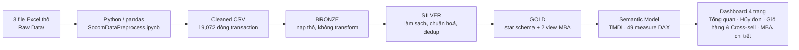
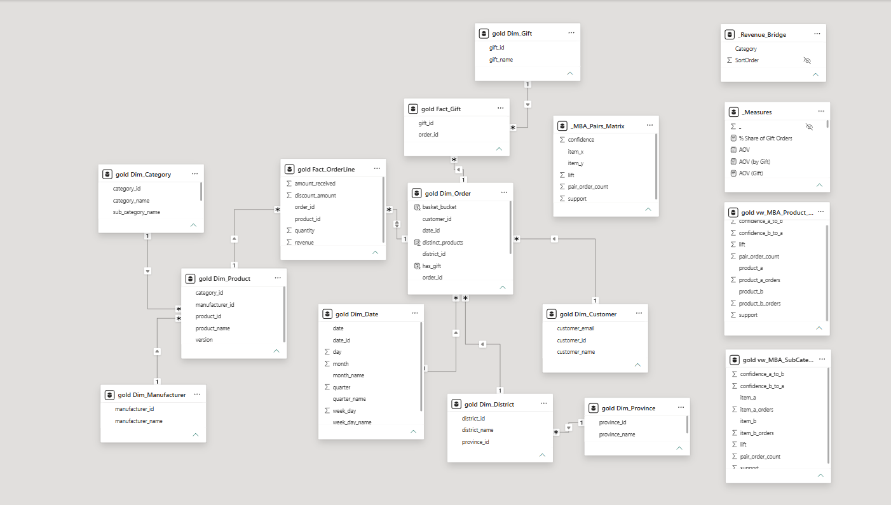
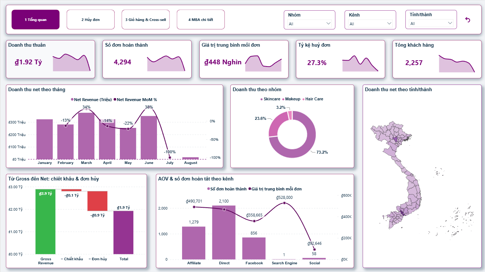
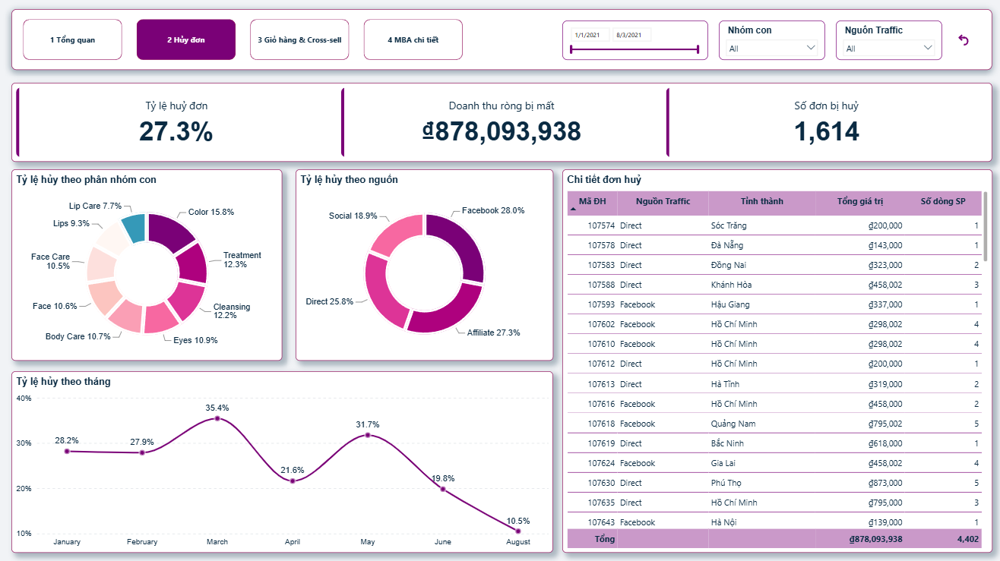
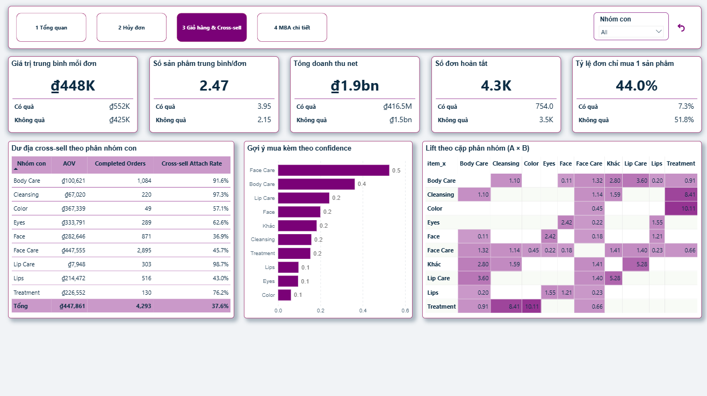
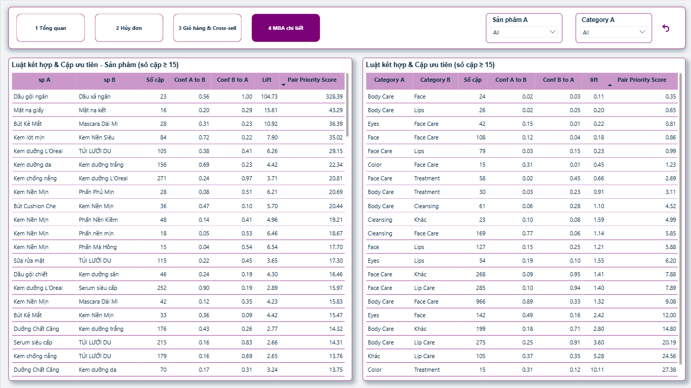

<div align="center">

# SOCOM Market Basket Analysis

### Tìm đúng cặp sản phẩm đáng gợi ý mua kèm

<p>
  
  
  
  
</p>

</div>

---

## Project Overview

Xuất phát điểm của project chỉ có 3 file Excel thô trong `Raw Data/`: dữ liệu bán hàng synthetic năm 2021 của **SOCOM**, nhà phân phối mỹ phẩm tại Việt Nam (L'Oréal Paris, Maybelline New York, Garnier). Toàn bộ phần còn lại (pipeline ETL Python, data warehouse kiến trúc Medallion 3 tầng trên SQL Server, semantic model 49 measure DAX, và dashboard Power BI 4 trang này) đều được xây từ đó.

Đề bài được giao cho project này là **phân tích Market Basket Analysis (MBA)**: tìm cặp sản phẩm hoặc nhóm sản phẩm đáng gợi ý mua kèm cho SOCOM. Ngoài phần MBA, dashboard được mở rộng thêm 3 trang (Tổng quan, Hủy đơn, Giỏ hàng & Cross-sell) để có đủ ngữ cảnh kinh doanh trước khi đi vào MBA chi tiết, mỗi trang gắn với 1 nhóm câu hỏi và 1 nhóm stakeholder cụ thể, không chỉ báo cáo số liệu tổng quan.

Các câu hỏi project trả lời:

- Business đang khoẻ không? Doanh thu đến từ đâu? _(Chủ DN / quản lý chung)_
- Mất bao nhiêu doanh thu vì huỷ đơn? Rò rỉ dồn ở đâu? _(Vận hành / CSKH)_
- Vì sao giỏ hàng nhỏ? Điều gì kéo giỏ hàng to hơn? _(Marketing / merchandising)_
- Nên gợi ý mua kèm sản phẩm hoặc nhóm nào? _(Merchandising / CRM)_

> ⚠️ **Dữ liệu là synthetic (giả lập cho năm 2021).** Mọi số liệu trong README này minh hoạ phương pháp phân tích, không phải phát hiện kinh doanh thật.

## Table of Contents

- [SOCOM Market Basket Analysis](#socom-market-basket-analysis)
  - [Tìm đúng cặp sản phẩm đáng gợi ý mua kèm](#tìm-đúng-cặp-sản-phẩm-đáng-gợi-ý-mua-kèm)
  - [Project Overview](#project-overview)
  - [Table of Contents](#table-of-contents)
  - [Project Highlights](#project-highlights)
  - [Repository Structure](#repository-structure)
  - [Raw Data](#raw-data)
  - [Data Pipeline](#data-pipeline)
  - [Semantic Model](#semantic-model)
  - [Dashboard](#dashboard)
  - [Key Findings](#key-findings)
  - [Tech Stack](#tech-stack)

## Project Highlights

| Area                   | What this project does                                                                                                                                                                                        |
| ---------------------- | ------------------------------------------------------------------------------------------------------------------------------------------------------------------------------------------------------------- |
| Data pipeline          | Python/pandas làm sạch 3 file Excel thô → CSV; SQL Server Medallion Bronze → Silver → Gold, dedup theo `(order_id, product_name, version)`, stored procedure DROP & CREATE chạy lại an toàn.                  |
| Semantic model         | Star schema Gold (10 bảng Dim/Fact) + 49 measure DAX chia 7 display folder (Revenue, Orders, Basket & AOV, Customer, Time Intelligence, Gift, MBA).                                                           |
| Market Basket Analysis | 2 tầng phân tích: cặp phân nhóm sản phẩm (`vw_MBA_SubCategory_Pairs`) và cặp sản phẩm cụ thể (`vw_MBA_Product_Pairs`), xếp hạng bằng measure tự thiết kế `Pair Priority Score = lift × ln(pair_order_count)`. |
| Cross-sell diagnostics | `Cross-sell Attach Rate` theo từng phân nhóm sản phẩm + so sánh Có quà/Không quà trên AOV, Basket Size, Net Revenue, Single-item Order %.                                                                     |
| Dashboard              | 4 trang Power BI (PBIR/PBIP), theme màu BIBB, thanh điều hướng dạng pill tự thiết kế, slicer đồng bộ liên trang.                                                                                              |

## Repository Structure

```text
Market basket Association/
|-- Raw Data/                                        # có sẵn từ đầu (gitignored, PII/synthetic, 3 file Excel)
|-- Cleaned_Data/                                     # xây trong quá trình làm (gitignored trừ product_category_map.xlsx)
|-- SocomDataPreprocess.ipynb                         # xây trong quá trình làm (Python ETL: Raw XLSX -> Cleaned CSV)
|-- SQL/                                              # xây trong quá trình làm
|   |-- init_database.sql, jobs_schedule.sql
|   |-- Bronze/   ddl_bronze_tables.sql, sp_load_bronze.sql, check_bronze_quality.sql
|   |-- Silver/   ddl_silver_tables.sql, sp_load_silver.sql, check_silver_quality.sql
|   `-- Gold/     ddl_gold_tables.sql, sp_load_gold.sql  (+ 2 view MBA)
|-- Power BI Project/                                 # xây trong quá trình làm (PBIP: TMDL model + PBIR report)
|   |-- SocomDataAnalysis.SemanticModel/
|   |-- SocomDataAnalysis.Report/
|   `-- SocomDataAnalysis.pbip
|-- Power BI Theme by BIBB.json                       # theme màu dùng cho dashboard
|-- Docs/                                             # data catalog, kế hoạch thiết kế dashboard
`-- Imgs/                                             # screenshot dashboard + model diagram (dùng trong README)
```

## Raw Data

Nguồn duy nhất của project là **3 file Excel thô trong `Raw Data/`** (gitignored, tên dạng hash do export trực tiếp từ hệ thống bán hàng, không nói lên nội dung):

| File                                          | Số dòng    |
| --------------------------------------------- | ---------- |
| `Socom_04e14a99bbb240a29b11ba42501e7b20.xlsx` | 18,340     |
| `Socom_0fcb53d5c8ea41a4bc91888407aad9a4.xlsx` | 4,993      |
| `Socom_c8310f3ad637482a906c628998c5bd38.xlsx` | 127        |
| **Tổng**                                      | **23,460** |

**Dữ liệu bán hàng năm 2021 của SOCOM**, dạng bảng phẳng; mỗi dòng có thể là dòng sản phẩm, dòng phí vận chuyển, hoặc dòng quà tặng (phân biệt qua `product_name`):

- `manufacturer`: Nhãn hàng
- `customer` / `customer_email`: Tên và email khách hàng
- `date`: Ngày đặt hàng
- `traffic_source`: Kênh lưu lượng truy cập
- `referral`: URL nguồn giới thiệu đơn hàng
- `branch`: Kho/gian hàng xử lý đơn
- `product_category`: Danh mục sản phẩm
- `province` / `district`: Tỉnh/thành, quận/huyện giao hàng
- `order_id`: Mã đơn hàng
- `product_name`: Tên sản phẩm (hoặc cờ đánh dấu dòng phí ship / quà tặng)
- `version`: Phiên bản, dung tích sản phẩm
- `order_status`: Trạng thái đơn hàng (Hủy / Không hủy)
- `payment_method`: Phương thức thanh toán
- `revenue`: Doanh thu gross theo dòng
- `discount_amount`: Số tiền khuyến mãi
- `total_invoice`: Tổng hóa đơn
- `amount_received`: Số tiền thực nhận
- `quantity`: Số lượng
- `shipping_fee`: Phí vận chuyển

**Xử lý dữ liệu chính trong `SocomDataPreprocess.ipynb`:**

- Gộp 3 file, loại các bản ghi trùng khít toàn bộ cột (đề phòng file export bị lặp)
- Đổi tên 36 cột từ tiếng Việt sang tiếng Anh
- Bỏ các cột dư thừa/không dùng được: `year`, `month` (trùng `date`), `parameter`, 5 cột `utm_*`, `created_by`, `page`, `sale_channel`, `sku`, `payment_status`, `order_count`, `net_revenue`
- Tách 3 luồng nghiệp vụ theo `product_name`: bằng `"--"` → dòng shipping; khớp `[quà tặng]` / `[gift]` / `[Quà tặng không bán]` → dòng quà tặng; còn lại → dòng giao dịch sản phẩm thật
- Chuẩn hoá `referral` về base URL, map qua danh sách domain phổ biến thành `traffic_source` (Facebook, Affiliate, Search Engine, Social, Direct)
- Lọc bỏ bản ghi dùng email test hệ thống (`test@test.com` và biến thể)
- Đồng bộ lại gift/shipping theo `order_id` còn hợp lệ sau khi lọc email test, tránh `order_id` mồ côi
- Map `category`/`sub_category` bằng AI chạy local qua Ollama (model `qwen2.5:7b-instruct`, không gọi API ngoài, `mapping_ollama.py`), theo taxonomy cố định 4 category / 10 sub_category, temperature=0 để kết quả ổn định; tên không chắc bị gán `UNKNOWN` thay vì đoán bừa, rồi review tay 146 tên (chủ yếu các dòng `UNKNOWN`)
- Xuất 3 file CSV: `Transaction_Data.csv`, `Gift_Data.csv`, `Shipping_Data.csv`

## Data Pipeline



Chi tiết từng bảng/cột và transformation qua 3 tầng Bronze → Silver → Gold: [`Docs/DATA_CATALOG.md`](Docs/DATA_CATALOG.md).

## Semantic Model



Star schema Gold:

- `Fact_OrderLine`: dòng đơn hàng (grain = order_id × product_id)
- `Fact_Gift`: quà tặng theo đơn (order_id × gift_id)
- `Dim_Order`: đơn hàng, nối `Dim_Customer`, `Dim_Date`, `Dim_District` → `Dim_Province`
- `Dim_Product`: sản phẩm, nối `Dim_Category` (gộp category + sub_category), `Dim_Manufacturer`
- `Dim_Gift`: quà tặng

Không có `Dim_Region` vì `branch` = kho/gian hàng, không đủ dữ liệu địa lý.

**49 measure DAX**, chia 7 display folder (Revenue, Orders, Basket & AOV, Customer, Time Intelligence, Gift, MBA); 30 measure được dùng trực tiếp trên dashboard. Các measure phức tạp nhất trong số đó:

- `Cross-sell Attach Rate`: dùng `REMOVEFILTERS` + `SUMMARIZE` để đếm số sub_category khác nhau trong 1 đơn, bất kể đang lọc theo category nào
- `Basket Size`: `AVERAGEX` lặp qua từng đơn, mỗi đơn tính `DISTINCTCOUNT` sản phẩm rồi lấy trung bình
- `Single-item Order %`: dùng biến bảng (`VAR` + `FILTER`) để đếm đơn chỉ có đúng 1 sản phẩm trên tổng đơn hoàn tất
- `Pair Priority Score` / `Pair Priority Score (Product)`: measure tự thiết kế `MAX(lift) × LN(MAX(pair_order_count))`, kết hợp độ mạnh liên kết với độ tin cậy khối lượng mẫu
- `Revenue Bridge Value`: dùng `SWITCH(SELECTEDVALUE(...))` trên 1 bảng disconnected để dựng waterfall Gross → Net
- `Net Revenue MoM %`: dùng `DATEADD` time intelligence, phụ thuộc measure ẩn `Net Revenue PM`
- `AOV (Gift)` / `AOV (No Gift)`: lọc đơn theo có/không tồn tại dòng khớp ở `Fact_Gift` bằng `ISBLANK(CALCULATE(COUNTROWS(...)))`

## Dashboard

**1. Tổng quan**: 5 KPI card (doanh thu, đơn hoàn thành, AOV, tỷ lệ huỷ, khách hàng), doanh thu theo tháng, theo nhóm sản phẩm, theo tỉnh/thành, waterfall Gross→Net, AOV theo kênh


**2. Hủy đơn**: 3 KPI card rò rỉ doanh thu, tỷ lệ huỷ theo phân nhóm/nguồn/tháng, bảng chi tiết đơn huỷ, slicer khoảng ngày dạng thanh trượt


**3. Giỏ hàng & Cross-sell**: 5 KPI card so sánh Có quà/Không quà, bảng dư địa cross-sell theo phân nhóm, bar gợi ý mua kèm theo confidence, heatmap lift theo cặp phân nhóm


**4. MBA chi tiết**: 2 bảng luật kết hợp & cặp ưu tiên, song song ở 2 cấp độ: cặp sản phẩm cụ thể và cặp phân nhóm (lọc `pair_order_count ≥ 15`, sắp theo Pair Priority Score)


## Key Findings

> **Cancel Rate** = tỷ lệ đơn có `order_status = "Hủy"` trên tổng số đơn (measure `Cancel Rate = DIVIDE([Cancelled Orders],[Orders])`).
>
> **Cross-sell Attach Rate** = trong số đơn hoàn tất có mua sản phẩm thuộc phân nhóm X, % đơn đó có mua kèm thêm ≥ 1 phân nhóm khác. Attach Rate càng thấp = dư địa cross-sell cho nhóm đó càng lớn.
>
> **Pair Priority Score** = `lift × ln(pair_order_count)`. Kết hợp cả độ mạnh liên kết (lift) lẫn khối lượng mẫu (pair_order_count): 1 cặp lift cao nhưng chỉ xảy ra ở vài đơn sẽ bị xếp hạng thấp hơn 1 cặp lift vừa phải nhưng lặp lại ở hàng chục đơn.

**Số liệu quan sát được:**

- Doanh thu net **₫1,92 tỷ**, gross **₫2,89 tỷ**; huỷ đơn "ăn" **₫878 triệu** doanh thu ròng, tương ứng **27,3%** tổng số đơn (1.614/5.908 đơn).
- Huỷ đơn dồn vào 2 kênh Affiliate (**27,3%**) và Facebook (**28,0%**), cao hơn hẳn Direct (**25,8%**); tỷ lệ huỷ theo tháng dao động mạnh **10,5%–35,4%**, đỉnh vào tháng 3 và tháng 5.
- Đào sâu 2 đỉnh này theo kênh, danh mục, thanh toán, ngày trong tuần và tỉnh/thành thì thấy khác nhau: đỉnh tháng 5 có lý do thật, do Hồ Chí Minh (thị trường lớn nhất) tự tăng tỷ lệ huỷ lên **44,2%** và kéo cả nước theo; còn đỉnh tháng 3 tăng rải đều ở gần như mọi kênh/tỉnh/nhóm hàng cùng lúc, không quy được về 1 nguyên nhân cụ thể nào, nhiều khả năng chỉ là nhiễu ngẫu nhiên của bộ dữ liệu synthetic chứ không phải vấn đề kinh doanh thật.
- Basket Size trung bình chỉ **2,47** sản phẩm/đơn; **44,0%** đơn chỉ mua đúng 1 sản phẩm, cho thấy dư địa cross-sell còn lớn ở phần lớn đơn hàng.
- Đơn có quà tặng có AOV cao hơn **30%** so với đơn không quà (**₫552K** so với **₫425K**), nhưng điều tra ngược dữ liệu gốc cho thấy việc gán quà gần như ngẫu nhiên, nên chênh lệch này nhiều khả năng là tương quan giả chứ không phải hiệu ứng thật của chương trình quà tặng.
- Ở cấp phân nhóm, cặp mạnh nhất là **Color × Treatment** (lift 10,11, Pair Priority Score cao nhất trong nhóm này) nhưng khối lượng mẫu nhỏ chỉ 15 đơn.
- Ở cấp sản phẩm cụ thể, cặp **Dầu gội ngăn × Dầu xả ngăn** vượt trội hẳn: confidence **100%** (mua dầu xả thì luôn kèm dầu gội), lift **104,73**, Pair Priority Score **328,39**, cao gấp gần **10 lần** cặp mạnh nhất ở cấp phân nhóm (33,84).

**Đề xuất hành động:**

1. Ưu tiên xử lý huỷ đơn ở kênh Affiliate và Facebook trước: đây là 2 kênh có tỷ lệ huỷ cao nhất, thu hẹp ở đây tác động tới phần lớn trong ₫878 triệu doanh thu đang bị mất.
2. Với đỉnh huỷ đơn tháng 5, rà lại vận hành tại Hồ Chí Minh trước: tỷ lệ huỷ ở đây tự tăng lên 44,2%, đủ lớn để kéo cả nước theo. Với đỉnh tháng 3 thì không cần điều tra thêm, vì tăng rải đều khắp nơi chứ không quy được về 1 nguyên nhân cụ thể, nhiều khả năng chỉ là nhiễu dữ liệu chứ không phải vấn đề vận hành thật.
3. Đưa cặp "Dầu gội ngăn × Dầu xả ngăn" thành gợi ý mua kèm mặc định đầu tiên khi triển khai cross-sell: confidence 100%, lift vượt trội gấp gần 10 lần cặp tốt nhất ở cấp phân nhóm, rủi ro thấp nhất khi thử nghiệm.
4. Nhắm chiến dịch cross-sell vào các phân nhóm có Attach Rate thấp nhất (Face, Face Care) trước, thay vì các nhóm đã bão hoà (Cleansing, Lip Care đã > 97%): biên độ tăng giỏ hàng ở nhóm thấp lớn hơn nhiều.
5. Không dùng chương trình quà tặng hiện tại làm đòn bẩy AOV có chủ đích cho tới khi thiết kế lại rule gắn quà theo ngưỡng giá trị/sản phẩm cụ thể: mức +30% AOV quan sát được hiện tại nhiều khả năng không phải hiệu ứng nhân quả.

## Tech Stack

**SQL Server** (T-SQL, stored procedure, MERGE, dynamic SQL cho Medallion Bronze/Silver/Gold) · **Python / pandas / Jupyter** (ETL Raw Excel → Cleaned CSV) · **Power BI Desktop** (semantic model TMDL, DAX, dashboard PBIR/PBIP) · Git.
